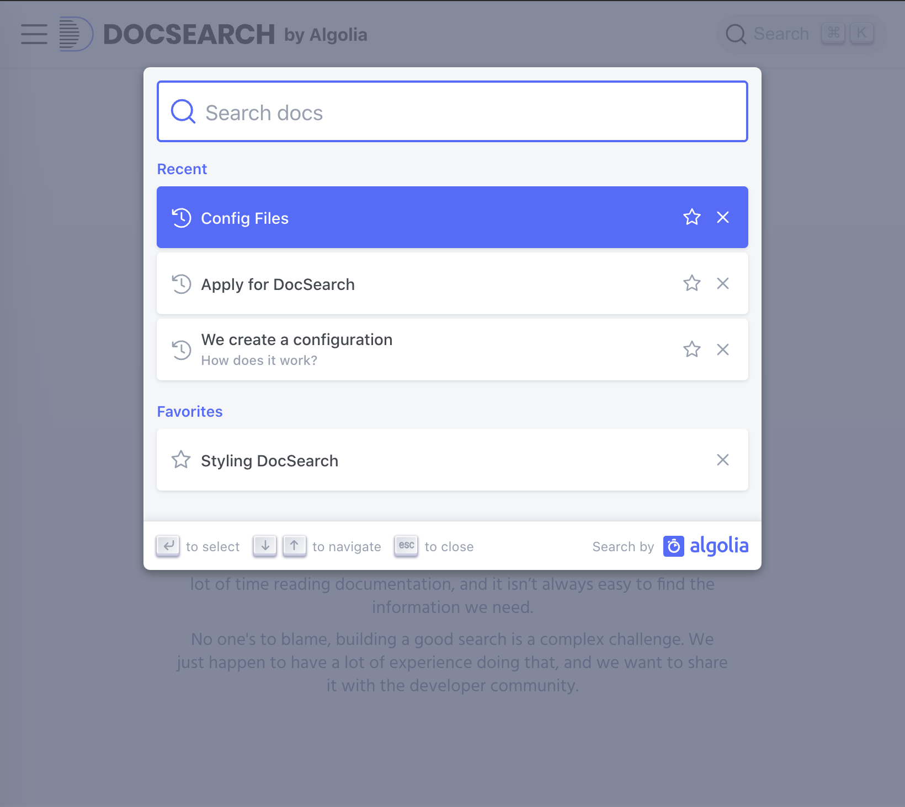
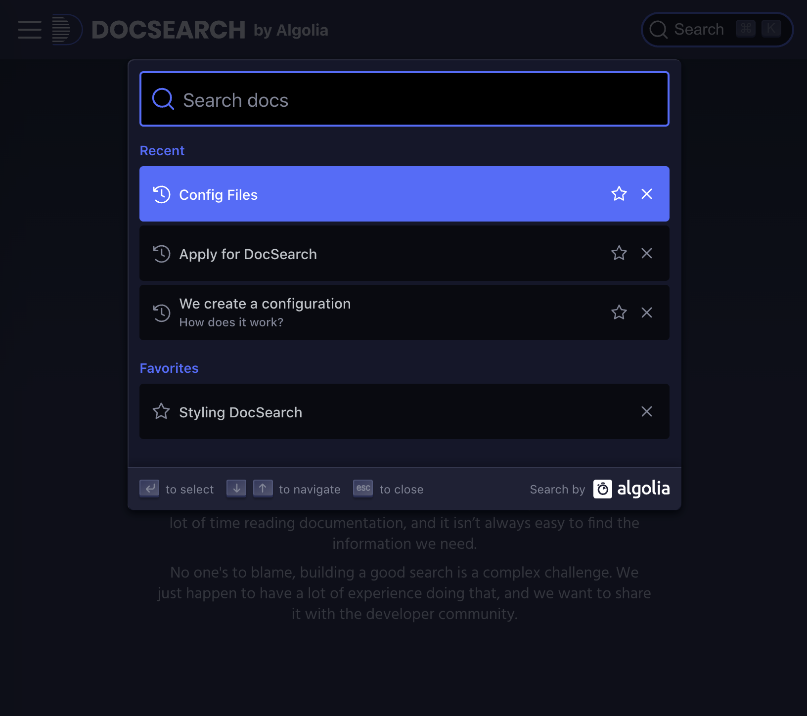

<div align="center">

[](https://docsearch.algolia.com)

The easiest way to add search to your documentation – for free.

[](https://www.npmjs.com/package/@docsearch/js/v/alpha) [](./LICENSE)
  
<p align="center">
  <strong>
  <a href="https://docsearch.algolia.com">Documentation</a> •
  <a href="https://codesandbox.io/s/docsearchjs-v3-playground-z9oxj">JavaScript Playground</a> •
  <a href="https://codesandbox.io/s/docsearch-react-v3-playground-619yg">React Playground</a>
  </strong>
</p>

</div>

---

DocSearch crawls your documentation, pushes the content to an Algolia index and provides a dropdown search experience on your website.

## Preview


| Light | Dark |
| --- | --- |
|  |  |

## Usage

> Don't have your Algolia credentials yet? [Apply to DocSearch](https://docsearch.algolia.com/apply)!

**1.** Import the library as an ECMAScript module:

```sh
npm install @docsearch/js@alpha
# or
yarn add @docsearch/js@alpha
```

```js
import docsearch from '@docsearch/js';
```

**1–bis.** Or with a script tag (at the end of the `body`):

```html
<script src="https://cdn.jsdelivr.net/npm/@docsearch/js@alpha"></script>
```

**2.** Use the library:

```js
docsearch({
  container: '#docsearch',
  indexName: 'YOUR_INDEX_NAME',
  apiKey: 'YOUR_API_KEY',
});
```

**3.** [Customize the color scheme](https://docsearch.algolia.com/docs/styling/).

## Related projects

DocSearch is made of the following repositories:

- **[algolia/docsearch](https://github.com/algolia/docsearch)**: DocSearch source code.
- **[algolia/docsearch-website](https://github.com/algolia/docsearch-website)**: DocSearch website and documentation.
- **[algolia/docsearch-configs](https://github.com/algolia/docsearch-configs)**: DocSearch websites configurations that DocSearch powers.
- **[algolia/docsearch-scraper](https://github.com/algolia/docsearch-scraper)**: DocSearch crawler that extracts data from your documentation.

## License

[MIT](LICENSE)
