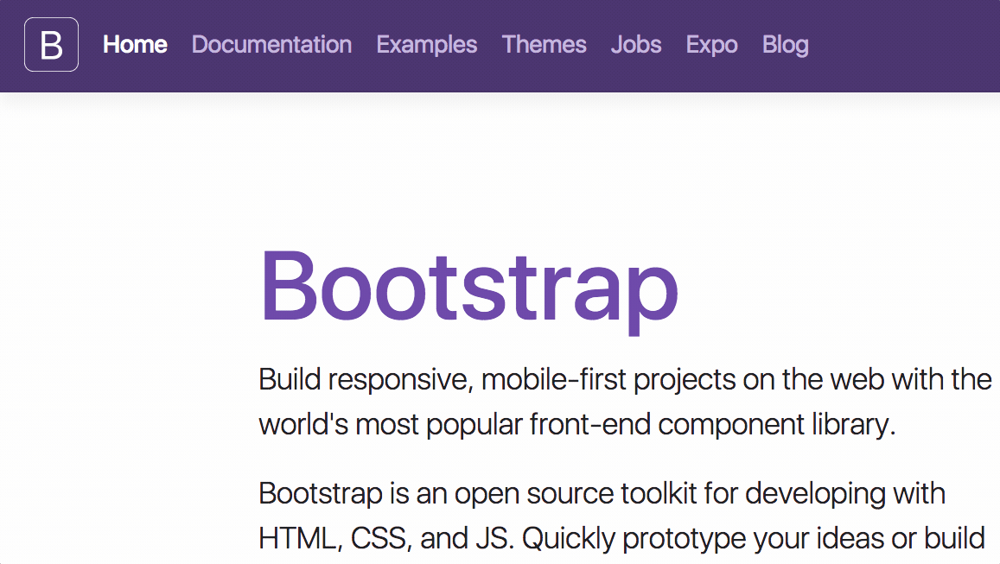

The easiest way to add search to your documentation – for free.

  

  <strong>
  <a href="https://docsearch.algolia.com">Documentation</a> •
  <a href="https://codesandbox.io/s/docsearchjs-v3-playground-z9oxj">JavaScript Playground</a> •
  <a href="https://codesandbox.io/s/docsearch-react-v3-playground-619yg">React Playground</a>
  </strong>

---

DocSearch crawls your documentation, pushes the content to an Algolia index and provides a dropdown search experience on your website.

## Preview

## Usage

> Don't have your Algolia credentials yet? [Apply to DocSearch](https://docsearch.algolia.com/apply)!

This version of DocSearch is deprecated and no longer maintained, but you can still [browse the documentation](https://docsearch.algolia.com/docs/legacy/dropdown).

We recommend everyone to [upgrade to DocSearch v3](https://docsearch.algolia.com/docs/DocSearch-v3) in order to receive support for their UI and the latest features!
