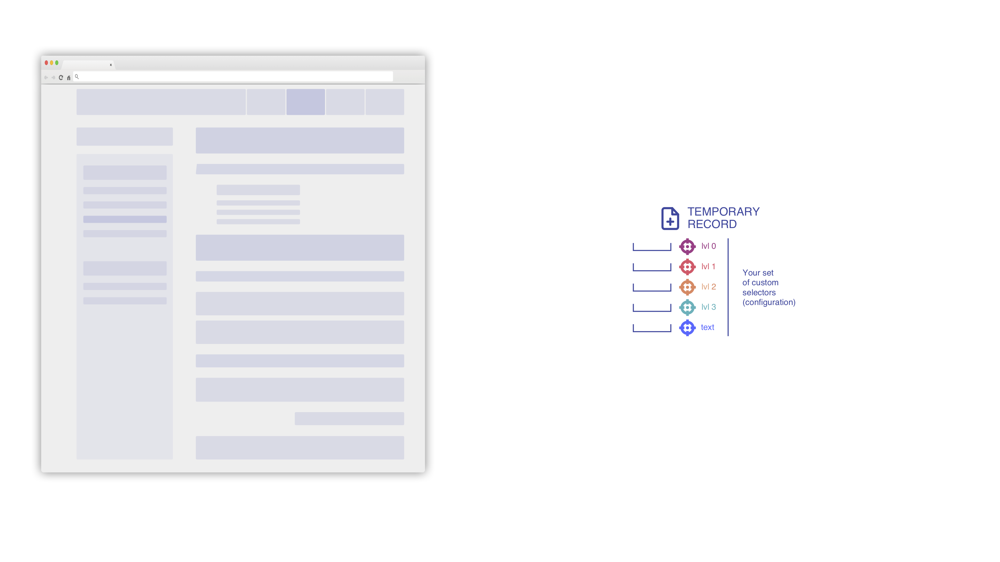
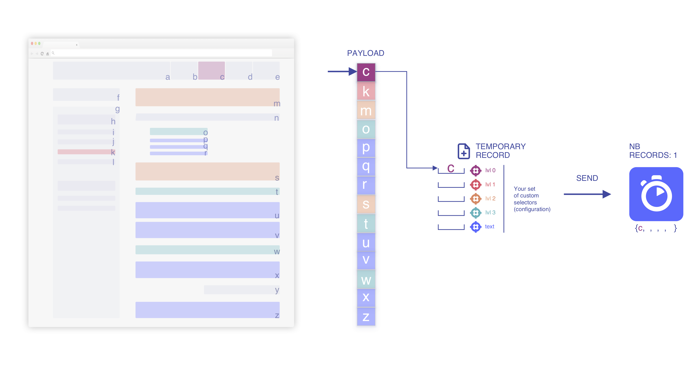
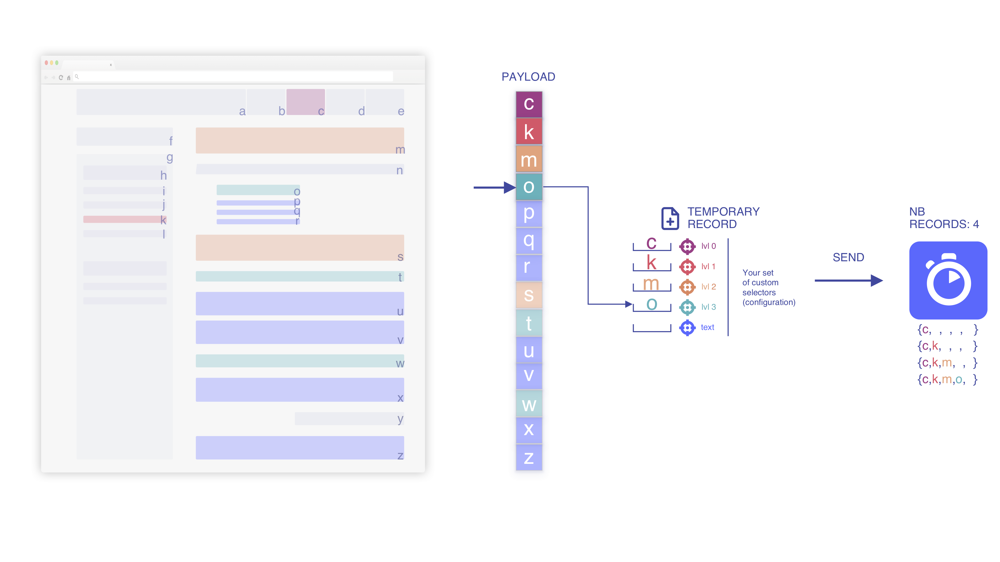
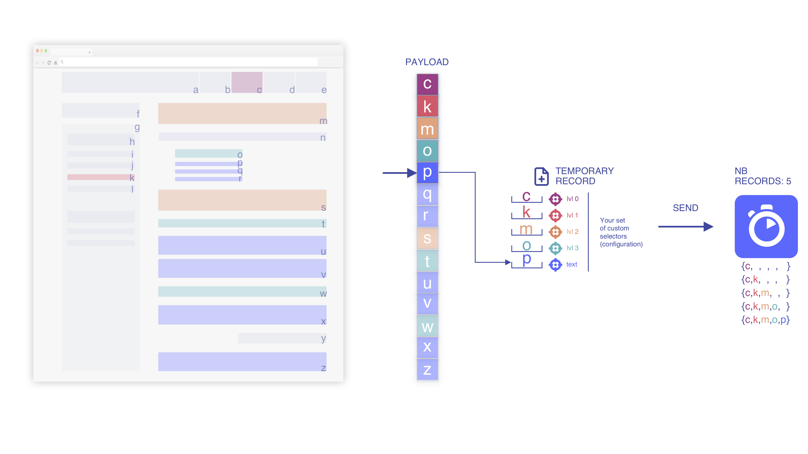
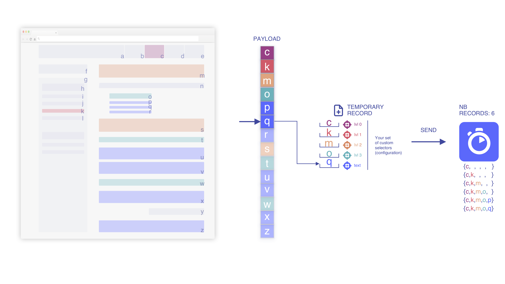

In this section you will learn how we build a DocSearch index from your page.

### Everything starts from your page

_Note: We would rather avoid useless js rendering. All useful information should
be available without any client-side rendering. You can use `curl` in order to
have a better idea of how it would look without any client-side rendering._

### We extract the payload thanks to your set of `selectors`

We will focus on the highlighted information depending on your selectors.

### We iterate though the HTML flow and build the payload

This payload will be the only data extracted from your page.

### We iterate though the payload and start pushing records

We index the temporary record when we add an element to it (if
`min_indexed_level` is set to `0`)

### We pile up the elements based on the current temporary record

Base on the position within the flow, we nest elements as much as possble to
keep the contextual relevancy.

### We iterate until we match a `text` element

### We override the text element when we find a newer one

### We remove the stashed, deeper elements when we add a higher level

Contextual information and hierarchy must be updated once we encounter a new
level since it highlights a new sub-section not related to the previous one.

If you need any further information, please [do not hesitate, send us your
feedback][1].

[1]: mailto:docsearch@algolia.com
